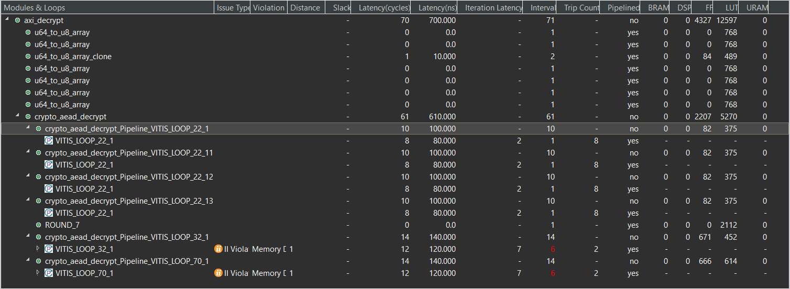

# Ascon IP for Zynq 7000
 An HDL implementation of the Ascon algorithm using the official C reference implementation. Part of a project for Embedded Systems Exam, more reference on [naplespu.com/es](http://www.naplespu.com/es/index.php?title=Implementazione_HLS_di_un_acceleratore_hardware_di_cifratura/decifratura_mediante_l%27algoritmo_Ascon#Ascon) (need credentials to have access). The IP is meant to be integrated on a Xilinx Zynq 7000 Zybo Board. You can see this as a simple guide (in Italian) to program a Zynq 7000 Zybo with a custom IP using Vitis HLS, Vivado e Vitis.
**Target Board : xc7z010-clg400-1**

# Installation
To use the IP in your project you can directly download the IPs in the archives **AxiDec5.zip** and **AxiEnc5.zip** in Ascon-IP-for-Zynq-7000/VitisHLS/EsperimentiVitisHLS/ and then, after extracting the directories you can add the path on your PC where the IP were extracted to the Tools->Settings-> IP-> Repository-> + (Add Repository)  in Vivado so that you can use them in a block design as catalog IPs.

## Codice:

Codice soluzione 5: Ascon-IP-for-Zynq-7000/VitisHLS/EsperimentiVitisHLS/source/

Codice soluzione 1: Ascon-IP-for-Zynq-7000/VitisHLS/EsperimentiVitisHLS/SoluzioniPrecedenti/source_8bit/

Codice soluzione 2: Ascon-IP-for-Zynq-7000/VitisHLS/EsperimentiVitisHLS/SoluzioniPrecedenti/source_64bit/

Codice soluzione 3: Ascon-IP-for-Zynq-7000/VitisHLS/EsperimentiVitisHLS/SoluzioniPrecedenti/source_sol3/

Codice soluzione 4: Ascon-IP-for-Zynq-7000/VitisHLS/EsperimentiVitisHLS/SoluzioniPrecedenti/source_sol4/

### Per la soluzione finale
Il codice rilevante è quello dei moduli :

- **aead.c**, in cui vengono riscritte le funzioni **crypto_aead_encrypt()** e **crypto_aead_decrypt()** in termini delle sottofunzioni initialize_state, additional_data_func, process_data_enc(/process_data_dec), finalize_state_enc(/finalize_state_dec) e ascon_state_set;
- **axi_ascon.c**, in cui vengono definiti i wrapper delle suddette funzioni di crittografia al fine di adattarle al protocollo di interfacciamento AXI Full, e dove si sfrutta per adattare i dati in ingresso una utility function u64_to_u8_array;
- **axi_ascon.h**, in cui sono semplicemente presentate le interfacce delle nuove funzioni wrapper.

### Per le Soluzioni precedenti
Il codice relativo alle funzioni axi_encrypt e axi_decrypt sono contenute nel file temp.c e i prototipi sono contenuti nel file temp.h. Tali File sono poi usati oltre che per la sintesi di Vitis HLS anche del testbench tb_temp.c.

### Rilevanza delle soluzioni precedenti 
Il senso di implementazioni alternative nasce dal fatto che per via di esigenze di progetto potrei avere dei vincoli di spazio più stringenti e più tolleranza per quanto riguarda i tempi di esecuzione. In tal caso in base ai vincoli di progetto si può intergrare una IP più adatta alle esigenze specifiche. In particolare le IP della soluzione 1 occupano un numero di LUTs che è circa la metà di quelle occupate dalle IP della soluzione finale, la quale invece compensa con prestazioni in termini di throughput migliori.

## Obiettivo primario
Questo progetto nasce dal tentativo di migliorare la legibilità del codice, utilizzare il protocollo AXI Full invece che AXI lite in quanto più adatto per la trasmissione di dati più corposi di 32 bit e migliorare le performance della IP presentata nell' [articolo di documentazione](http://www.naplespu.com/es/index.php?title=Implementazione_HLS_di_un_acceleratore_hardware_di_cifratura/decifratura_mediante_l%27algoritmo_Ascon#Ascon), in particolare si cerca di usare in un primo momento le seguenti direttive per migliorare le performance in termini di latenza a discapito di una maggiore occupazione in termini di risorse Hardware su FPGA. Le seguenti direttive servono a ottimizzare il codice come descritto:


\#pragma HLS PIPELINE: Utilizzato nei loop per aumentare il throughput riducendo la latenza.

\#pragma HLS DATAFLOW: Utilizzato per parallelizzare diverse fasi di elaborazione.

\#pragma HLS UNROLL: Espande le iterazioni di un loop per creare più istanze hardware.

\#pragma HLS INLINE: Forza l'inlining di una funzione.

\#pragma HLS ARRAY_PARTITION: Partiziona un array per permettere accessi paralleli (consente accessi paralleli agli array).

\#pragma HLS RESOURCE: Permette di specificare l'uso delle risorse hardware per ottimizzare l'implementazione.


Tuttavia tali ottimizzazioni tendono a parallelizzare le operazioni ma risulta una intrinseca dipendenza tra le operazioni in termini temporali quindi la maggior parte delle operazioni non può essere parallelizzata, come mostrato nella seguente immagine.

.png)

Inoltre non è stato necessario quasi in nessun caso l'utilizzo delle direttive pragma in quanto la maggior parte delle volte Vitis opera autonomamente le ottimizzazioni possibili.

## Versione Pipelined (soluzione 4 e 5)
Tuttavia si può cercare ancora di scomporre l'algoritmo di Ascon in un certo numero di fasi separate per ottenere una struttura pipelined in modo che i risultati del primo blocco vengano presi in ingresso dal successivo. 

Il beneficio di tale approccio potrebbe esistere nel momento in cui si richiedano ripetute operazioni di encrypt o decrypt. Ciò ha particolarmente senso se il tempo di computazione dell'algoritmo è varie volte maggiore del tempo richiesto per la manipolazione dei dati (che sfrutta il protocollo AXI per il caricamento dei dati nell'IP e l'utility function **u64_to_u8_array()**)in ingresso che costituisce di fatto il primo blocco di tale pipeline.

Il codice relativo a tale soluzione è quello nella directory Ascon-IP-for-Zynq-7000/VitisHLS/EsperimentiVitisHLS/source, in particolare abbiamo le top function (relative alle IP) nel file

Ascon-IP-for-Zynq-7000/VitisHLS/EsperimentiVitisHLS/source/axi_ascon.c 
 
mentre le modifiche per rendere l'IP pipelined (con una pipeline di 4 stadi in entrambi i casi) sono modifiche al codice di riferimento ufficiale di [Ascon](https://github.com/ascon/ascon-c/blob/main/crypto_aead/ascon128av12/ref/aead.c) nel file 

Ascon-IP-for-Zynq-7000/VitisHLS/EsperimentiVitisHLS/source/axi_ascon.c

Le performance teoriche di tale soluzione sono nettamente migliori rispetto alle altre in termini di latenza (ma non in termini di occupazione spaziale): 




Sebbene la latenza teorica risulti molto bassa in realtà il vantaggio vero si ha quanto più si può tenere piena la pipeline nel tempo, in un caso di workload di questo tipo allora si può ottenere un throughput (Throughput= (numero di operazioni)/(tempo per la loro esecuzione)) prossimo a quello teorico, ossia che tende al limite superiore (upperbound) pari al reciproco del tempo di esecuzione (latenza) del blocco più lento della pipe. Ci si avvicina a tale valore nel caso in cui si abbia un gran numero di operazioni di encrypt(o decrypt) consecutive e si tiene la pipeline sempre piena.

Alla base di tale soluzione ci sono dei registri a cavallo tra due blocchi consecutivi della pipe volto a mantenere lo stato. Si usa a tal scopo in C una variabile di stato ascon_state_t s relativa a ciascun stadio della pipeline. In C tale comportamento è ottenuto tramite 4 variabili di stato s1,s2,s3,s4 e un utility function per l'assegnazione:

```
void ascon_state_set(ascon_state_t *a, ascon_state_t b){
	a->x[0]=b.x[0];
	a->x[1]=b.x[1];
	a->x[2]=b.x[2];
	a->x[3]=b.x[3];
	a->x[4]=b.x[4];
}
```

## Come aggiungere l'IP al catalogo di Vivado
Dopo aver eseguito i test necessari nel testbench previsto sul codice C si può eseguire il comando Run Syntesis. Una volta valutate che le performance soddisfino le proprie esigenze (performance relative alle 3 soluzioni in RefactoringImages) si può passare ad esportare l'IP da VitisHLS con File->Export che genererà un archivio zip Export.zip che costituisce il blocco della IP specificata come top level function in Project Settings-> Syntesis.

Dopodichè bisogna estrarre l'archivio in una cartella con nome appropriato (bisogna farlo sia per la funzione axi\_encrypt sia per axi\_dectrypt).

## Aggiunta al catalogo Vivado
Per aggiungere l'ip al catalogo in vivado si va su Tools->Settings-> IP-> Repository-> + (Add Repository) e si aggiungono le cartelle dove erano state esportate le IP generate con Vitis HLS.

## Block Design

.png)

Dopo aver generato il Block disgn si può generare il platform file del progetto.

Per usare la funzionalità Create HDL Wrapper in vivado si usa tasto destro sul block design (file .bd nella cartella Design Sources). 
Poi eseguendo Generate Bitstream otteniamo il platform file (XSA) che poi andremo ad esportare (File->Export->Export Hardware (include bitstream)). Una volta ottenuto il Platform File .xsa lo potremo aprire in Vitis. 

## Programmazione PS

### Creazione Platform project
In Vitis dopo aver aperto un workspace creiamo un nuovo platform project per ottenere alla fine il nostro .xpfm, quindi selezionamo il nostro xsa di partenza con browse e selezioniamo come OS una standalone application (a meno che non serva un OS per altre elaborazioni, in tal caso agire di conseguenza).


### Creazione Application Project (Standalone application)
Dopo aver creato la zynq platform su vitis, creiamo un nuovo application project (utile partire dal template Hello world per avere i file per l'inizializazione della scheda e main.c autogenerati) e selezioniamo la nostra Piattaforma custom. Abbiamo ora nella cartella Applicatio/Sources/src un linker script, un file di inizializazione platform.c e un file in cui è contenuto il nostro main() (hello_world.c). Useremo la funzione main per inizializzare ed usare le nostre IP servendoci delle funzioni AXI ad esse relative automaticamente generate da VITIS.

.png)

Dettagli sulle interfacce AXI per le ip in C:\Path\To\Vitis\Platform\Project\platformAscon\zynq_fsbl\zynq_fsbl_bsp\hw_artifacts\drivers


Application Project path : C:\Path\To\Vitis\Application\Project\Vitis\ApplicationAscon_FromTemplateHelloWorld\src

## Versioni 
| Numero versione relativo alle immagini  | Source Dir   | IP | 
|-----------------------------------------|--------------|----|
|       1                                 | source_8bit  | 1  |
|       2                                 |              |    |
|       3                                 |              |    |
|       4                                 |              |    |
|       5                                 | source_64bit | 2  |
|       6                                 | source       | 3  |
|       7                                 | source       | 4  |


|IP  | Performance Encryption | Performance Decryption  |
|----|------------------------|-------------------------|
|1   |||
|2   |.png)|.png)|
|3   |.png)|.png)|
|4   |.png)|.png)|


La soluzione più semplice e facile da leggere è quella relativa alla IP 1. Possiamo ottimizzare l'ip facendo la raccolta di dati su vettori uint64_t e poi convertendoli in vettori uint8_t(2). Questa raccolta può essere fatta anche in parallelo(3). In casi di workload dove si riesce a tenere la pipeline sempre piena allora la soluzione 4 offre notevoli benefici prestazionali.


